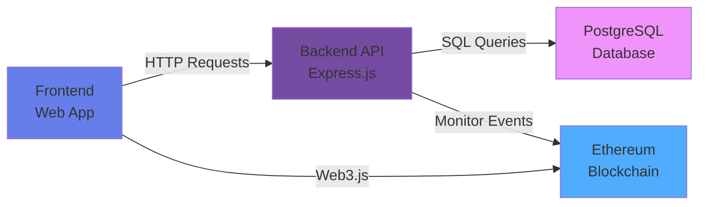

<div align="center">

# 🗳️ BLOCKCHAIN E-VOTING SYSTEM
### PostgreSQL Backend Integration


**[Features](#-features) • [Quick Start](#-quick-start) • [API Docs](#-api-endpoints) • [Architecture](#-architecture) • [Contributing](#-contributing)**

</div>

---

## 🌟 Features

<table>
<tr>
<td width="50%">

### 🔒 Security First
- **Commit-Reveal Scheme** - Cryptographic vote privacy
- **Keccak256 Hashing** - Secure commitments
- **Access Control** - Role-based permissions
- **SQL Injection Protection** - Parameterized queries

</td>
<td width="50%">

### 📊 Analytics Powered
- **PostgreSQL Backend** - Advanced querying
- **Real-Time Dashboard** - Live statistics
- **Audit Trail** - Complete transaction history
- **Export Reports** - CSV, PDF generation

</td>
</tr>
<tr>
<td width="50%">

### ⛓️ Blockchain Tech
- **Ethereum Smart Contracts** - Immutable records
- **Solidity 0.8.27** - Latest features
- **Hardhat Framework** - Professional tooling
- **Web3.js Integration** - Seamless interaction

</td>
<td width="50%">

### 🚀 Modern Stack
- **RESTful API** - Complete backend
- **Express.js** - High-performance server
- **CORS Enabled** - Cross-origin support
- **Environment Config** - Secure deployment

</td>
</tr>
</table>

---

## 📋 Prerequisites

<div align="center">

| 📦 Requirement | 🔢 Version | 🔗 Download |
|:--------------|:----------|:-----------|
| **Node.js** | 16.0.0+ | [nodejs.org](https://nodejs.org/) |
| **PostgreSQL** | 13+ | [postgresql.org](https://postgresql.org/) |
| **Ganache CLI** | Latest | `npm install -g ganache` |
| **Git** | Latest | [git-scm.com](https://git-scm.com/) |

</div>

---

## 🚀 Quick Start

### 📥 Step 1: Clone Repository

```bash
git clone https://github.com/yourusername/blockchain-evoting.git
cd blockchain-evoting
```

<details>
<summary>📸 Screenshot</summary>

```
Cloning into 'blockchain-evoting'...
remote: Enumerating objects: 100, done.
remote: Counting objects: 100% (100/100), done.
✅ Repository cloned successfully!
```

</details>

### 📦 Step 2: Install Dependencies

```bash
# Install main dependencies
npm install

# Install backend dependencies
npm install express pg dotenv cors body-parser
```

<details>
<summary>📋 Package List</summary>

- `express` - Web framework
- `pg` - PostgreSQL client
- `dotenv` - Environment variables
- `cors` - Cross-origin resource sharing
- `body-parser` - Request body parsing

</details>

### 🗄️ Step 3: PostgreSQL Setup

#### Create Database

```sql
-- Create database
CREATE DATABASE evoting_db;

-- Connect to database
\c evoting_db;
```

#### Create Tables

<details>
<summary>📊 Click to expand full schema</summary>

```sql
-- Contracts table
CREATE TABLE contracts (
    id SERIAL PRIMARY KEY,
    contract_address VARCHAR(42) UNIQUE NOT NULL,
    owner_address VARCHAR(42) NOT NULL,
    deployed_at TIMESTAMP DEFAULT CURRENT_TIMESTAMP,
    status VARCHAR(20) DEFAULT 'active'
);

-- Proposals table
CREATE TABLE proposals (
    id SERIAL PRIMARY KEY,
    contract_address VARCHAR(42) NOT NULL,
    proposal_id INTEGER NOT NULL,
    name VARCHAR(255) NOT NULL,
    description TEXT,
    FOREIGN KEY (contract_address) REFERENCES contracts(contract_address),
    UNIQUE(contract_address, proposal_id)
);

-- Voters table
CREATE TABLE voters (
    id SERIAL PRIMARY KEY,
    contract_address VARCHAR(42) NOT NULL,
    voter_address VARCHAR(42) NOT NULL,
    added_at TIMESTAMP DEFAULT CURRENT_TIMESTAMP,
    added_by VARCHAR(42) NOT NULL,
    FOREIGN KEY (contract_address) REFERENCES contracts(contract_address),
    UNIQUE(contract_address, voter_address)
);

-- Votes table
CREATE TABLE votes (
    id SERIAL PRIMARY KEY,
    contract_address VARCHAR(42) NOT NULL,
    voter_address VARCHAR(42) NOT NULL,
    proposal_id INTEGER,
    commit_hash VARCHAR(66),
    committed_at TIMESTAMP,
    revealed_at TIMESTAMP,
    transaction_hash VARCHAR(66),
    FOREIGN KEY (contract_address) REFERENCES contracts(contract_address),
    UNIQUE(contract_address, voter_address)
);

-- Voting phases table
CREATE TABLE voting_phases (
    id SERIAL PRIMARY KEY,
    contract_address VARCHAR(42) NOT NULL,
    phase VARCHAR(20) NOT NULL,
    started_at TIMESTAMP DEFAULT CURRENT_TIMESTAMP,
    started_by VARCHAR(42) NOT NULL,
    FOREIGN KEY (contract_address) REFERENCES contracts(contract_address)
);

-- Results table
CREATE TABLE results (
    id SERIAL PRIMARY KEY,
    contract_address VARCHAR(42) NOT NULL,
    proposal_id INTEGER NOT NULL,
    vote_count INTEGER DEFAULT 0,
    updated_at TIMESTAMP DEFAULT CURRENT_TIMESTAMP,
    FOREIGN KEY (contract_address) REFERENCES contracts(contract_address),
    UNIQUE(contract_address, proposal_id)
);

-- Create indexes for performance
CREATE INDEX idx_votes_contract ON votes(contract_address);
CREATE INDEX idx_votes_voter ON votes(voter_address);
CREATE INDEX idx_proposals_contract ON proposals(contract_address);
CREATE INDEX idx_voters_contract ON voters(contract_address);
CREATE INDEX idx_phases_contract ON voting_phases(contract_address);
```

</details>

### ⚙️ Step 4: Environment Configuration

Create `.env` file in project root:

```env
# Database Configuration
DB_HOST=localhost
DB_PORT=5432
DB_NAME=evoting_db
DB_USER=postgres
DB_PASSWORD=your_password_here

# Server Configuration
PORT=3001
NODE_ENV=development

# Blockchain Configuration
GANACHE_URL=http://127.0.0.1:8545
```

> ⚠️ **Security Warning:** Never commit `.env` file to version control!

### 🎬 Step 5: Start All Services

You'll need **4 terminals**:

#### Terminal 1️⃣: Start Ganache

```bash
ganache -h 127.0.0.1 -p 8545 -d
```

```
Ganache CLI v6.12.2 (ganache-core: 2.13.2)
Starting RPC server at http://127.0.0.1:8545
✅ Ganache running on port 8545
```

#### Terminal 2️⃣: Deploy Smart Contract

```bash
npx hardhat run --network localhost scripts/deploy.js
```

```
Deploying BlindVoting contract...
Contract deployed to: 0x5FbDB2315678afecb367f032d93F642f64180aa3
✅ Deployment successful!
```

#### Terminal 3️⃣: Start Backend API

```bash
node backend/server.js
```

```
✅ PostgreSQL connected successfully
✅ Backend API running on http://localhost:3001
```

#### Terminal 4️⃣: Start Frontend

```bash
npx http-server -p 3000
```

```
Starting up http-server, serving ./
Available on:
  http://127.0.0.1:3000
✅ Frontend running on port 3000
```

---

## 📁 Project Structure

```
blockchain-evoting/
│
├── 📂 backend/
│   ├── server.js              # 🖥️ Express server
│   ├── db.js                  # 🗄️ PostgreSQL connection
│   ├── 📂 routes/
│   │   ├── contracts.js       # 📝 Contract routes
│   │   ├── voters.js          # 👥 Voter routes
│   │   ├── votes.js           # 🗳️ Voting routes
│   │   ├── phases.js          # 🔄 Phase routes
│   │   └── analytics.js       # 📊 Analytics routes
│   └── 📂 middleware/
│       └── errorHandler.js    # ⚠️ Error handling
│
├── 📂 contracts/
│   └── BlindVoting.sol        # 🔐 Smart contract
│
├── 📂 scripts/
│   └── deploy.js              # 🚀 Deployment script
│
├── 📂 frontend/
│   ├── index.html             # 🌐 Main UI
│   ├── app.js                 # ⚡ Frontend logic
│   └── styles.css             # 🎨 Styling
│
├── .env                       # 🔒 Environment variables
├── hardhat.config.js          # ⚙️ Hardhat config
├── package.json               # 📦 Dependencies
└── README.md                  # 📖 This file
```

---

## 🌐 API Endpoints

### 📝 Contract Management

<div align="center">

| Method | Endpoint | Description |
|:------:|:---------|:------------|
|  | `/api/contracts` | Register new contract |
|  | `/api/contracts/:address` | Get contract details |
|  | `/api/contracts` | List all contracts |

</div>

**Example Request:**

```bash
curl -X POST http://localhost:3001/api/contracts \
  -H "Content-Type: application/json" \
  -d '{
    "contractAddress": "0x5FbDB2315678afecb367f032d93F642f64180aa3",
    "ownerAddress": "0x90F8bf6A479f320ead074411a4B0e7944Ea8c9C1"
  }'
```

<details>
<summary>📤 Response Example</summary>

```json
{
  "success": true,
  "data": {
    "id": 1,
    "contract_address": "0x5FbDB2315678afecb367f032d93F642f64180aa3",
    "owner_address": "0x90F8bf6A479f320ead074411a4B0e7944Ea8c9C1",
    "deployed_at": "2024-10-24T10:30:00.000Z",
    "status": "active"
  }
}
```

</details>

### 👥 Voter Management

<div align="center">

| Method | Endpoint | Description |
|:------:|:---------|:------------|
|  | `/api/voters` | Add eligible voter |
|  | `/api/voters/:contractAddress` | Get all voters |
|  | `/api/voters/:contractAddress/:voterAddress` | Remove voter |

</div>

### 🗳️ Voting Operations

<div align="center">

| Method | Endpoint | Description |
|:------:|:---------|:------------|
|  | `/api/votes/commit` | Record commit transaction |
|  | `/api/votes/reveal` | Record reveal transaction |
|  | `/api/votes/:contractAddress` | Get all votes |

</div>

**Commit Vote Example:**

```bash
curl -X POST http://localhost:3001/api/votes/commit \
  -H "Content-Type: application/json" \
  -d '{
    "contractAddress": "0x5Fb...",
    "voterAddress": "0x90F...",
    "commitHash": "0xabc123...",
    "transactionHash": "0xdef456..."
  }'
```

### 🔄 Phase Management

<div align="center">

| Method | Endpoint | Description |
|:------:|:---------|:------------|
|  | `/api/phases` | Record phase change |
|  | `/api/phases/:contractAddress` | Get phase history |

</div>

### 📊 Analytics & Reports

<div align="center">

| Method | Endpoint | Description |
|:------:|:---------|:------------|
|  | `/api/analytics/:contractAddress/summary` | Voting summary |
|  | `/api/analytics/:contractAddress/turnout` | Voter turnout stats |
|  | `/api/analytics/:contractAddress/timeline` | Voting timeline |
|  | `/api/analytics/:contractAddress/results` | Final results |

</div>

<details>
<summary>📊 Example Response (Summary)</summary>

```json
{
  "totalVoters": 100,
  "totalVotes": 87,
  "turnoutPercentage": 87.0,
  "currentPhase": "reveal",
  "topProposal": {
    "name": "Proposal A",
    "votes": 45
  }
}
```

</details>

---

## 🏗️ Architecture

### System Overview



### Data Flow

```
┌─────────────────────────────────────────────────────────────┐
│                    DEPLOYMENT PHASE                          │
├─────────────────────────────────────────────────────────────┤
│ 1. Smart contract deployed to Ganache                       │
│ 2. Contract address registered in PostgreSQL                │
└─────────────────────────────────────────────────────────────┘
                            ⬇️
┌─────────────────────────────────────────────────────────────┐
│                      SETUP PHASE                             │
├─────────────────────────────────────────────────────────────┤
│ 1. Owner adds proposals → Blockchain & DB                   │
│ 2. Owner adds eligible voters → Blockchain & DB             │
└─────────────────────────────────────────────────────────────┘
                            ⬇️
┌─────────────────────────────────────────────────────────────┐
│                     COMMIT PHASE                             │
├─────────────────────────────────────────────────────────────┤
│ 1. Voters submit hashed votes → Blockchain                  │
│ 2. Backend logs commit transactions → DB                    │
└─────────────────────────────────────────────────────────────┘
                            ⬇️
┌─────────────────────────────────────────────────────────────┐
│                     REVEAL PHASE                             │
├─────────────────────────────────────────────────────────────┤
│ 1. Voters reveal actual votes → Blockchain                  │
│ 2. Backend updates vote records → DB                        │
│ 3. Results calculated and stored                            │
└─────────────────────────────────────────────────────────────┘
                            ⬇️
┌─────────────────────────────────────────────────────────────┐
│                   ANALYTICS PHASE                            │
├─────────────────────────────────────────────────────────────┤
│ 1. Backend aggregates data from DB                          │
│ 2. Real-time statistics provided via API                    │
└─────────────────────────────────────────────────────────────┘
```

---

## 📊 Database Schema

### Entity Relationship Diagram

```
┌─────────────────┐
│   contracts     │
│─────────────────│
│ id (PK)         │
│ contract_addr   │◄──────┐
│ owner_address   │       │
│ deployed_at     │       │
│ status          │       │
└─────────────────┘       │
                          │
        ┌─────────────────┼─────────────────┬─────────────────┐
        │                 │                 │                 │
        ▼                 ▼                 ▼                 ▼
┌──────────────┐  ┌──────────────┐  ┌──────────────┐  ┌──────────────┐
│  proposals   │  │    voters    │  │    votes     │  │   results    │
│──────────────│  │──────────────│  │──────────────│  │──────────────│
│ id (PK)      │  │ id (PK)      │  │ id (PK)      │  │ id (PK)      │
│ contract(FK) │  │ contract(FK) │  │ contract(FK) │  │ contract(FK) │
│ proposal_id  │  │ voter_addr   │  │ voter_addr   │  │ proposal_id  │
│ name         │  │ added_at     │  │ proposal_id  │  │ vote_count   │
│ description  │  │ added_by     │  │ commit_hash  │  │ updated_at   │
└──────────────┘  └──────────────┘  │ committed_at │  └──────────────┘
                                    │ revealed_at  │
                                    │ tx_hash      │
                                    └──────────────┘
```

---

## 🔒 Security Features

<div align="center">

| Feature | Description | Status |
|:--------|:------------|:------:|
| **🛡️ Commit-Reveal Scheme** | Prevents vote buying and coercion | ✅ Implemented |
| **🔐 Keccak256 Hashing** | Cryptographic commitment security | ✅ Implemented |
| **👤 Access Control** | Only owner can manage phases | ✅ Implemented |
| **💉 SQL Injection Protection** | Parameterized queries | ✅ Implemented |
| **🌐 CORS Configuration** | Restricted cross-origin access | ✅ Implemented |
| **🔑 Environment Variables** | No hardcoded sensitive data | ✅ Implemented |

</div>

---

## 📈 Analytics Queries

### Get Total Votes

```sql
SELECT COUNT(*) as total_votes 
FROM votes 
WHERE contract_address = '0x...' 
  AND revealed_at IS NOT NULL;
```

### Calculate Turnout Percentage

```sql
SELECT 
    (COUNT(DISTINCT v.voter_address)::float / 
     COUNT(DISTINCT vo.voter_address) * 100) as turnout_percentage
FROM votes v
RIGHT JOIN voters vo ON v.voter_address = vo.voter_address
WHERE vo.contract_address = '0x...';
```

### Get Results by Proposal

```sql
SELECT 
    p.name, 
    p.description,
    COALESCE(r.vote_count, 0) as votes
FROM proposals p
LEFT JOIN results r ON p.proposal_id = r.proposal_id 
    AND p.contract_address = r.contract_address
WHERE p.contract_address = '0x...'
ORDER BY votes DESC;
```

### Voting Timeline (Hourly Breakdown)

```sql
SELECT 
    DATE_TRUNC('hour', committed_at) as hour,
    COUNT(*) as commit_count
FROM votes
WHERE contract_address = '0x...'
GROUP BY hour
ORDER BY hour;
```

---

## 🎯 Roadmap

```
✅ Phase 1 - Core Features (COMPLETE)
   ├── ✅ Smart contract with commit-reveal scheme
   ├── ✅ PostgreSQL integration
   ├── ✅ RESTful API
   └── ✅ Basic frontend

🚧 Phase 2 - Enhanced Features (IN PROGRESS)
   ├── ⏳ WebSocket real-time updates
   ├── ⏳ Admin dashboard
   ├── ⏳ Email notifications
   └── ⏳ Export reports (CSV, PDF)

🔜 Phase 3 - Production Ready
   ├── 📋 Multi-contract support
   ├── 📋 Role-based authentication
   ├── 📋 Rate limiting
   ├── 📋 Automated backups
   └── 📋 Docker deployment

🔮 Phase 4 - Advanced Features
   ├── 💡 Mobile app (React Native)
   ├── 💡 Anonymous voting with ZK-proofs
   ├── 💡 IPFS integration
   └── 💡 Multi-signature governance
```

---

## 🐛 Troubleshooting

### ⚠️ Cannot connect to PostgreSQL

**Solutions:**
- ✅ Check if PostgreSQL service is running (Windows Services / systemctl)
- ✅ Verify credentials in `.env` file
- ✅ Test connection: `psql -U postgres -d evoting_db`

### ⚠️ Port 3001 already in use

**Solutions:**

<details>
<summary>Windows</summary>

```bash
netstat -ano | findstr :3001
taskkill /F /PID <PID>
```

</details>

<details>
<summary>Linux/Mac</summary>

```bash
lsof -ti:3001 | xargs kill -9
```

</details>

Or change `PORT` in `.env` file.

### ⚠️ Ganache connection failed

**Solutions:**
- ✅ Ensure Ganache is running on port 8545
- ✅ Check `GANACHE_URL` in `.env`
- ✅ Restart Ganache with: `ganache -d -h 127.0.0.1 -p 8545`

### ⚠️ Transaction reverted

**Possible causes:**
- ❌ Incorrect voting phase
- ❌ Voter not registered
- ❌ Already voted
- ❌ Invalid proposal ID

Check Ganache logs for detailed error messages.

---

## 🧪 Testing

### Test Database Connection

```bash
node backend/db.js
```

**Expected Output:**
```
✅ PostgreSQL connected successfully
```

### Test API Health

```bash
curl http://localhost:3001/api/health
```

### Run Smart Contract Tests

```bash
npx hardhat test
```

---

## 🤝 Contributing

Contributions are what make the open source community amazing! Any contributions you make are **greatly appreciated**.

1. Fork the Project
2. Create your Feature Branch (`git checkout -b feature/AmazingFeature`)
3. Commit your Changes (`git commit -m 'Add some AmazingFeature'`)
4. Push to the Branch (`git push origin feature/AmazingFeature`)
5. Open a Pull Request

### Code Style Guidelines

- Use ES6+ features
- Follow Airbnb JavaScript Style Guide
- Add comments for complex logic
- Write tests for new features
- Update documentation

---

## 📄 License

Distributed under the MIT License. See `LICENSE` file for more information.

---

## 👥 Authors

<div align="center">

**Your Name** - [@yourusername](https://github.com/yourusername)

Project Link: [https://github.com/yourusername/blockchain-evoting](https://github.com/yourusername/blockchain-evoting)

</div>

---

## 🙏 Acknowledgments

- [OpenZeppelin](https://openzeppelin.com/) - Solidity security patterns
- [Ethereum Foundation](https://ethereum.org/) - Blockchain technology
- [PostgreSQL](https://www.postgresql.org/) - Excellent database
- [Hardhat](https://hardhat.org/) - Development framework
- [Express.js](https://expressjs.com/) - Web framework

---

## 📞 Support

Need help? Reach out to us:

- 📧 Email: support@evoting.com
- 💬 Discord: [Join our server](https://discord.gg/yourdiscord)
- 🐦 Twitter: [@yourtwitter](https://twitter.com/yourtwitter)
- 📖 Documentation: [Read the docs](https://docs.yourproject.com)

---

<div align="center">

### ⭐ Star History

[](https://star-history.com/#yourusername/blockchain-evoting&Date)

---

**Made with ❤️ and ☕ by Your Team**


[⬆ Back to Top](#-blockchain-e-voting-system)

</div>
